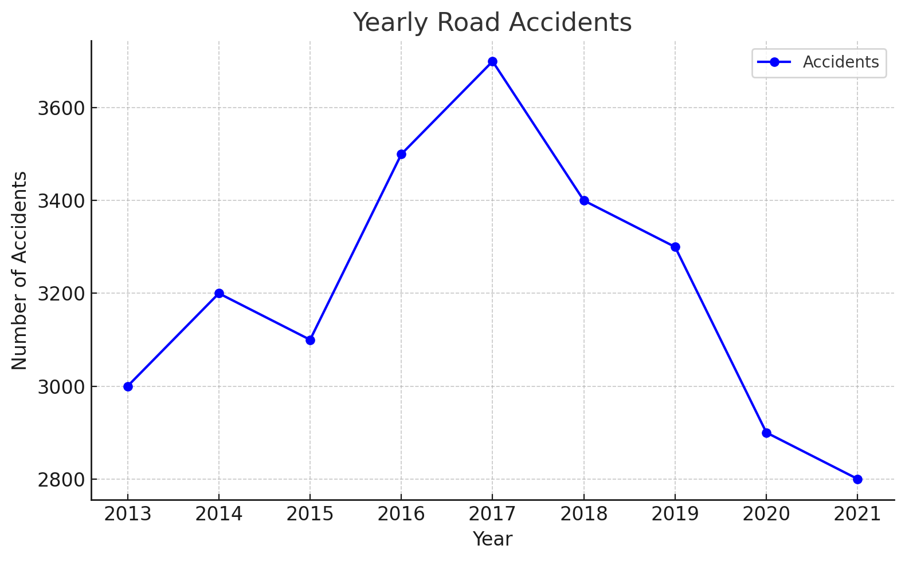
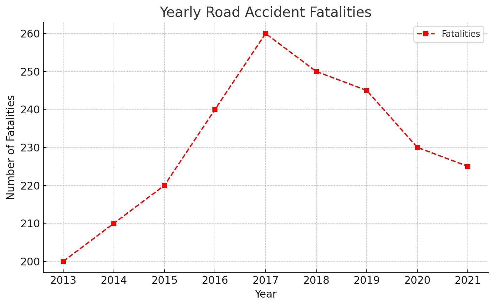

# Analysis_on_road_accidents_in_India
<!DOCTYPE html>
<html lang="en">
<head>
    <meta charset="UTF-8">
    <meta name="viewport" content="width=device-width, initial-scale=1.0">
    <title>Accident Analysis - README</title>
</head>
<body>
    <h1>Accident Analysis</h1>
    
This project involves analyzing road accident data using Python, aiming to understand patterns and factors contributing to accidents across different states and situations.

  <h2>Project Overview</h2>
    
The analysis utilizes various datasets that contain details of road accident deaths, lane-specific accident data, and general road accident statistics from 2013 to 2021. The analysis includes:

    <ul>
        <li>Data Preprocessing: Cleaning and transforming data for analysis.</li>
        <li>Exploratory Data Analysis (EDA): Visualizing accident patterns and trends over time.</li>
        <li>Modeling: Building predictive models using machine learning techniques to analyze the factors affecting accident rates.</li>
    </ul>

  <h2>Datasets Used</h2>
    
The project relies on multiple datasets including:

    <ul>
        <li><strong>Details_of_road_accident_deaths_by_situation_state_2014.xlsx</strong>: Contains state-wise accident details from 2014.</li>
        <li><strong>laneAccidents.xlsx</strong>: Provides information on accidents categorized by lanes.</li>
        <li><strong>accidents3-15.xlsx</strong>: Data covering accident details from 2013 to 2015.</li>
        <li><strong>RA2021_A13c.xlsx</strong>: Road accident statistics for 2021.</li>
        <li><strong>roadAccStats13-16.csv</strong>: A CSV file with statistics from 2013 to 2016.</li>
    </ul>

  <h2>Setup and Installation</h2>
    
To run this analysis, you will need Python 3.x and the following libraries:

    <pre><code>
    numpy
    pandas
    matplotlib
    seaborn
    scikit-learn
    </code></pre>
    
Install the required libraries using:

    <pre><code>pip install numpy pandas matplotlib seaborn scikit-learn</code></pre>

  <h2>Usage</h2>
    
To run the notebook, follow these steps:

    <ol>
        <li>Clone the repository or download the notebook file.</li>
        <li>Place the required datasets in the same directory as the notebook.</li>
        <li>Open the notebook in Jupyter Notebook or Google Colab.</li>
        <li>Run the cells sequentially to reproduce the analysis.</li>
    </ol>
 <!DOCTYPE html>
<html lang="en">
<head>
    <meta charset="UTF-8">
    <meta name="viewport" content="width=device-width, initial-scale=1.0">
    <title>Accident Analysis - README</title>
</head>
<body>
    <h1>Accident Analysis</h1>
    
This project involves analyzing road accident data using Python, aiming to understand patterns and factors contributing to accidents across different states and situations.

   <h2>Project Overview</h2>
    
The analysis utilizes various datasets that contain details of road accident deaths, lane-specific accident data, and general road accident statistics from 2013 to 2021. The analysis includes:

    <ul>
        <li>Data Preprocessing: Cleaning and transforming data for analysis.</li>
        <li>Exploratory Data Analysis (EDA): Visualizing accident patterns and trends over time.</li>
        <li>Modeling: Building predictive models using machine learning techniques to analyze the factors affecting accident rates.</li>
    </ul>

   <h2>Datasets Used</h2>
    
The project relies on multiple datasets including:

    <ul>
        <li><strong>Details_of_road_accident_deaths_by_situation_state_2014.xlsx</strong>: Contains state-wise accident details from 2014.</li>
        <li><strong>laneAccidents.xlsx</strong>: Provides information on accidents categorized by lanes.</li>
        <li><strong>accidents3-15.xlsx</strong>: Data covering accident details from 2013 to 2015.</li>
        <li><strong>RA2021_A13c.xlsx</strong>: Road accident statistics for 2021.</li>
        <li><strong>roadAccStats13-16.csv</strong>: A CSV file with statistics from 2013 to 2016.</li>
    </ul>

   <h2>Setup and Installation</h2>
    
To run this analysis, you will need Python 3.x and the following libraries:

    <pre><code>
    numpy
    pandas
    matplotlib
    seaborn
    scikit-learn
    </code></pre>
    
Install the required libraries using:

    <pre><code>pip install numpy pandas matplotlib seaborn scikit-learn</code></pre>

  <h2>Usage</h2>
    
To run the notebook, follow these steps:

    <ol>
        <li>Clone the repository or download the notebook file.</li>
        <li>Place the required datasets in the same directory as the notebook.</li>
        <li>Open the notebook in Jupyter Notebook or Google Colab.</li>
        <li>Run the cells sequentially to reproduce the analysis.</li>
    </ol>

   <h2>Results</h2>
    
The analysis aims to provide insights into:

    <ul>
        <li>State-wise accident trends over different years.</li>
        <li>The impact of different road conditions and situations on accident rates.</li>
        <li>Predictive models to estimate future accident rates based on past data.</li>
    </ul>

   <h2>Visualizations</h2>
    
Below are some visualizations from the analysis:

   <h3>Yearly Road Accidents</h3>
    

  <h3>Yearly Road Accident Fatalities</h3>
    

  <h2>Results</h2>
    
The analysis aims to provide insights into:

    <ul>
        <li>State-wise accident trends over different years.</li>
        <li>The impact of different road conditions and situations on accident rates.</li>
        <li>Predictive models to estimate future accident rates based on past data.</li>
    </ul>

  <h2>Contributing</h2>
    
If you wish to contribute to this project, feel free to fork the repository and submit a pull request with your improvements.

  <h2>License</h2>
    
This project is licensed under the MIT License - see the LICENSE file for details.

  <h2>Acknowledgements</h2>
    
Thanks to the open data sources for providing the datasets used in this analysis.

</body>
</html>
